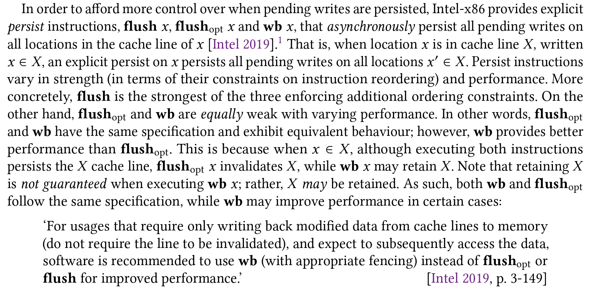
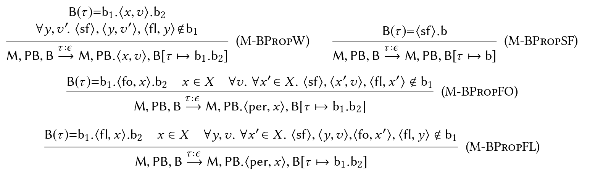

[[Persistency semantics of the Intel-x86 architecture|Px86]]

# 注释

(2022/6/26 下午3:44:25)

“instead there are multiple volatile caches in between. As such, writes may not propagate to memory at the time and in the order that the processor issues them, but rather at a later time and in the order decided by the cache coherence protocol” ([Raad 等。, 2020, p. 111](zotero://select/library/items/ZDDZXBRH)) ([pdf](zotero://open-pdf/library/items/JP7UATKU?page=1&annotation=BUZ9U7GK))

“More concretely, we develop the Px86 (‘persistent x86’) model by extending the x86-TSO (weak) memory model [Sewell et al. 2010] with the Intel-x86 persistency semantics as described informally in the Intel reference manual [Intel 2019].” ([Raad 等。, 2020, p. 112](zotero://select/library/items/ZDDZXBRH)) ([pdf](zotero://open-pdf/library/items/JP7UATKU?page=2&annotation=HDJD9WIQ))

“that the manual text is under-specified in that it allows for more behaviours than intended, underlining the ever-growing need for formal hardware specifications immune to misinterpretation.” ([Raad 等。, 2020, p. 112](zotero://select/library/items/ZDDZXBRH)) ([pdf](zotero://open-pdf/library/items/JP7UATKU?page=2&annotation=5P6LGVEM))

“To distinguish between the two memory orders, memory stores are differentiated from memory persists.” ([Raad 等。, 2020, p. 113](zotero://select/library/items/ZDDZXBRH)) ([pdf](zotero://open-pdf/library/items/JP7UATKU?page=3&annotation=YLBAR3YH))

“the Intel-x86 architecture follows a relaxed persistency model.” ([Raad 等。, 2020, p. 113](zotero://select/library/items/ZDDZXBRH)) ([pdf](zotero://open-pdf/library/items/JP7UATKU?page=3&annotation=CZNH478B))

“This way, persists occur after their corresponding stores and as prescribed by the persistent memory order; however, execution may proceed ahead of persists. As such, after recovering from a crash, only a prefix of the persistent memory order may have successfully persisted. As we describe shortly, the Intel-x86 architecture follows a buffered persistency model” ([Raad 等。, 2020, p. 113](zotero://select/library/items/ZDDZXBRH)) ([pdf](zotero://open-pdf/library/items/JP7UATKU?page=3&annotation=HBZG4TL7))

“the epoch persistency model provides a sync instruction which commits all pending writes, while Intel-x86 provides per-cache-line persist instructions which commit all pending writes on a given cache line” ([Raad 等。, 2020, p. 113](zotero://select/library/items/ZDDZXBRH)) ([pdf](zotero://open-pdf/library/items/JP7UATKU?page=3&annotation=SQPIEBB3))

“Moreover, explicit persist may themselves execute synchronously or asynchronously. For instance, the sync instruction in epoch persistency executes synchronously: it blocks until all pending writes are persisted. By” ([Raad 等。, 2020, p. 113](zotero://select/library/items/ZDDZXBRH)) ([pdf](zotero://open-pdf/library/items/JP7UATKU?page=3&annotation=NRPYF53J))

“contrast, the per-cache-line persist instructions of Intel-x86 execute asynchronously: they do not stall execution and merely guarantee that the cache line will be persisted at a future time.” ([Raad 等。, 2020, p. 114](zotero://select/library/items/ZDDZXBRH)) ([pdf](zotero://open-pdf/library/items/JP7UATKU?page=4&annotation=WMPMYPTD))

“Under the Px86 model the writes may be persisted (1) in any order, when they are on distinct locations; or (2) in the store order, when they are on the same location. That is, for each location, its store and persist orders coincide.” ([Raad 等。, 2020, p. 114](zotero://select/library/items/ZDDZXBRH)) ([pdf](zotero://open-pdf/library/items/JP7UATKU?page=4&annotation=73CFW7XC))

 ([pdf](zotero://open-pdf/library/items/JP7UATKU?page=4&annotation=RIPMJRXD)) ([Raad 等。, 2020, p. 114](zotero://select/library/items/ZDDZXBRH))

“both flushopt and flush instructions are ordered with respect to earlier (in program order) write instructions on the same cache line, as well as all (both earlier and later in program order) atomic read-modify-write (RMW) instructions regardless of the cache line” ([Raad 等。, 2020, p. 115](zotero://select/library/items/ZDDZXBRH)) ([pdf](zotero://open-pdf/library/items/JP7UATKU?page=5&annotation=KSTT44M2))

“instructions persist the X cache line asynchronously: their execution does not block until X is persisted; rather, the execution may proceed and X is made persistent at a future point.” ([Raad 等。, 2020, p. 115](zotero://select/library/items/ZDDZXBRH)) ([pdf](zotero://open-pdf/library/items/JP7UATKU?page=5&annotation=YQ5SEEDG))

“all writes on X ordered before C persist before all instructions ordered after C, regardless of their cache line” ([Raad 等。, 2020, p. 115](zotero://select/library/items/ZDDZXBRH)) ([pdf](zotero://open-pdf/library/items/JP7UATKU?page=5&annotation=5EN3Y5KB))

“certain instruction reorderings under Px86 mean that persist instructions may not execute at the intended program point and thus may not guarantee the intended persist ordering. For instance, when x′ ∈ X , the execution of flushopt x ′ is only ordered with respect to earlier writes on the same cache line X and thus may be reordered with respect to writes on locations in different cache lines, i.e. those not in X” ([Raad 等。, 2020, p. 115](zotero://select/library/items/ZDDZXBRH)) ([pdf](zotero://open-pdf/library/items/JP7UATKU?page=5&annotation=MXU2GWED))

“the execution of flushopt x′ is ordered only with respect to earlier writes on the same cache line, whereas the execution of flush x′ is ordered with respect to all (both earlier and later) writes regardless of the cache line.” ([Raad 等。, 2020, p. 116](zotero://select/library/items/ZDDZXBRH)) ([pdf](zotero://open-pdf/library/items/JP7UATKU?page=6&annotation=JJPMF4L9))

“Memory fences are strictly stronger than store fences: while memory fences cannot be reordered with respect to any memory instruction, store fences may be reordered with respect to only reads. That is, flushopt and flush cannot be reordered with respect to fences” ([Raad 等。, 2020, p. 116](zotero://select/library/items/ZDDZXBRH)) ([pdf](zotero://open-pdf/library/items/JP7UATKU?page=6&annotation=69IN2UD9))

“As such, if a crash occurs after z:= 1 has executed and persisted but before y:= 1 has persisted, it is possible to observe y=0, z=1 after recovery, even though y=0, z=1 is never possible during normal (non-crashing) executions.” ([Raad 等。, 2020, p. 116](zotero://select/library/items/ZDDZXBRH)) ([pdf](zotero://open-pdf/library/items/JP7UATKU?page=6&annotation=V2NXTZVI))

 ([pdf](zotero://open-pdf/library/items/JP7UATKU?page=8&annotation=GV9T4GS6)) ([Raad 等。, 2020, p. 118](zotero://select/library/items/ZDDZXBRH))

“In other words, one can model the reordering of a write w after a later read r (cell B1 of Fig. 3) by delaying the debuffering of w until after r has executed in real time.” ([Raad 等。, 2020, p. 119](zotero://select/library/items/ZDDZXBRH)) ([pdf](zotero://open-pdf/library/items/JP7UATKU?page=9&annotation=VGRZEG9V))

“Alternative x86-TSO Model with Load Buffers.” ([Raad 等。, 2020, p. 119](zotero://select/library/items/ZDDZXBRH)) ([pdf](zotero://open-pdf/library/items/JP7UATKU?page=9&annotation=DZ23PUP2))

“at any point a thread may pre-fetch the value of a location from memory and append it to its load buffer.” ([Raad 等。, 2020, p. 119](zotero://select/library/items/ZDDZXBRH)) ([pdf](zotero://open-pdf/library/items/JP7UATKU?page=9&annotation=EXKLBAUD))

“When a thread issues a read a:= x, it may proceed only if the first entry in its buffer is of the form ⟨x, v⟩,” ([Raad 等。, 2020, p. 119](zotero://select/library/items/ZDDZXBRH)) ([pdf](zotero://open-pdf/library/items/JP7UATKU?page=9&annotation=U7SVRGLW))

“To make sure that the execution of reads is not stuck, a thread may always discard the promoted entries from its buffer.” ([Raad 等。, 2020, p. 120](zotero://select/library/items/ZDDZXBRH)) ([pdf](zotero://open-pdf/library/items/JP7UATKU?page=10&annotation=XKUEJT5U))

“By allowing both types of entries in the buffer we can extend either model to Px86man.” ([Raad 等。, 2020, p. 120](zotero://select/library/items/ZDDZXBRH)) ([pdf](zotero://open-pdf/library/items/JP7UATKU?page=10&annotation=FSUDYS6I))

“More concretely, (1) the execution of writes is delayed in the buffer while reads are executed in real time, as before; and (2) the execution of sfence/flush/flushopt may be delayed or promoted in the buffer.” ([Raad 等。, 2020, p. 120](zotero://select/library/items/ZDDZXBRH)) ([pdf](zotero://open-pdf/library/items/JP7UATKU?page=10&annotation=Y5DZYC6U))

“When delayed writes in the thread-local buffer are debuffered, they are propagated to the persistent buffer; this debuffering denotes the store associated with the write, i.e. when the write is made visible to other thread” ([Raad 等。, 2020, p. 121](zotero://select/library/items/ZDDZXBRH)) ([pdf](zotero://open-pdf/library/items/JP7UATKU?page=11&annotation=AMEQXLG9))

“recall that under Px86 the writes on distinct locations may persist in any order (see Fig. 1a), while the writes on the same location persist in the store order” ([Raad 等。, 2020, p. 121](zotero://select/library/items/ZDDZXBRH)) ([pdf](zotero://open-pdf/library/items/JP7UATKU?page=11&annotation=W85SYVQS))

“A label may be ε, to denote silent transitions of no-ops; (R, x, v) to denote reading v from location x; (W, x, v) to denote writing v to location x; (U, x, v, v′) to denote a successful update (RMW) instruction modifying x to v ′ when its value matches v; MF or SF to denote the execution of mfence or sfence, respectively; and (FO, x) or (FL, x) to denote the execution of flushopt x or flush x, respectively.” ([Raad 等。, 2020, p. 122](zotero://select/library/items/ZDDZXBRH)) ([pdf](zotero://open-pdf/library/items/JP7UATKU?page=12&annotation=227BJK6N))

 ([pdf](zotero://open-pdf/library/items/JP7UATKU?page=13&annotation=YEYZ2SH3)) ([Raad 等。, 2020, p. 123](zotero://select/library/items/ZDDZXBRH))

([Raad 等。, 2020, p. 123](zotero://select/library/items/ZDDZXBRH)) 同一位置按照顺序durate 不同位置可以乱序 Flush指令维持序关系

“Dually, the order in which promoted entries are added denotes their store order, while the order in which they are debuffered (not discarded) corresponds to the program order.” ([Raad 等。, 2020, p. 126](zotero://select/library/items/ZDDZXBRH)) ([pdf](zotero://open-pdf/library/items/JP7UATKU?page=16&annotation=MMP9JMTW))

“As such, given promoted entries p, p′, a delayed entry d and a buffer b=p.d.p′, then: (1) p′ is store-ordered after p (p′ is added after p); d is program-ordered before p, p′ (d has reached its program point while p, p′ are yet to reach theirs); and (2) d is store-ordered after p, p′ (d is yet to reach its store point while p, p′ have reached theirs).” ([Raad 等。, 2020, p. 126](zotero://select/library/items/ZDDZXBRH)) ([pdf](zotero://open-pdf/library/items/JP7UATKU?page=16&annotation=3KVH5AGJ))

([Raad 等。, 2020, p. 129](zotero://select/library/items/ZDDZXBRH)) 意思就是nvo是前缀闭合的。一个事件persist了，在它之前的事件也必须persist

“define the semantics of a persistent program P as a set of valid chains associated with P. More concretely, a persistent program P=⟨P, rec⟩ is associated with a valid chain C=G1, · · · , Gn” ([Raad 等。, 2020, p. 130](zotero://select/library/items/ZDDZXBRH)) ([pdf](zotero://open-pdf/library/items/JP7UATKU?page=20&annotation=VCZ4H3V5))

“This is because: (1) the x86-TSO model simply does not model sfence instructions; and (2) extending x86-TSO with sfence is trivial in that in the absence of flushopt/flush operations, sfence instructions behave as no-ops.” ([Raad 等。, 2020, p. 131](zotero://select/library/items/ZDDZXBRH)) ([pdf](zotero://open-pdf/library/items/JP7UATKU?page=21&annotation=HVUJTJ2Y))

“Serialisability is the gold standard of transactional models as it provides strong guarantees with simple intuitive semantics” ([Raad 等。, 2020, p. 134](zotero://select/library/items/ZDDZXBRH)) ([pdf](zotero://open-pdf/library/items/JP7UATKU?page=24&annotation=YCVTLGC3))

“PSER provides (1) persist atomicity, ensuring that the persists in a transaction exhibit an all-or-nothing behaviour.” ([Raad 等。, 2020, p. 134](zotero://select/library/items/ZDDZXBRH)) ([pdf](zotero://open-pdf/library/items/JP7UATKU?page=24&annotation=N364WR5E))

“(2) strict, buffered persistency in that all concurrent transactions appear to persist one after another in the same total sequential order in which they (appear to) have executed.” ([Raad 等。, 2020, p. 134](zotero://select/library/items/ZDDZXBRH)) ([pdf](zotero://open-pdf/library/items/JP7UATKU?page=24&annotation=CVFQIIPF))

“The PTSO model of Raad and Vafeiadis [2018] is a persistency proposal for Intel-x86, and is rather different from the existing Intel-x86 model described by Intel [2019].” ([Raad 等。, 2020, p. 138](zotero://select/library/items/ZDDZXBRH)) ([pdf](zotero://open-pdf/library/items/JP7UATKU?page=28&annotation=6UQA4RAX))

“Second, persistency support in ARMv8 is more limited than in Intel-x86: ARMv8 provides a single persistence primitive, DC CVAP, which persists a given cache line to memory,” ([Raad 等。, 2020, p. 138](zotero://select/library/items/ZDDZXBRH)) ([pdf](zotero://open-pdf/library/items/JP7UATKU?page=28&annotation=XB93V2BU))

“Nevertheless, their semantic models are low-level, rendering them too complex for the inexperienced developers. The NVM community has thus moved towards high-level transactional approaches” ([Raad 等。, 2020, p. 138](zotero://select/library/items/ZDDZXBRH)) ([pdf](zotero://open-pdf/library/items/JP7UATKU?page=28&annotation=ZSJRPIY8))

“we plan to explore language-level persistency by researching persistency extensions of high-level languages such as C/C++.” ([Raad 等。, 2020, p. 138](zotero://select/library/items/ZDDZXBRH)) ([pdf](zotero://open-pdf/library/items/JP7UATKU?page=28&annotation=GGR3U936))