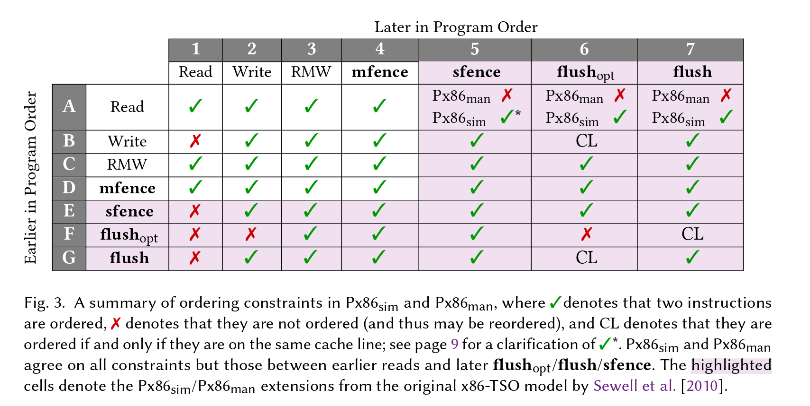

# Persistency semantics of the Intel-x86 architecture

## Persistency model

memory *store* is different from memory *persist*. In *relaxed* model, these two order does not coincide.

x86 is an **asynchronous** model, where writes are buffed and then persisted to memory non-deterministically. It also operates at the **cache-line** level.

**Explicit Persist**

There are several primitives for controling the persistence of writes. [[X86 persistency instructions]].

> “Moreover, explicit persist may themselves execute synchronously or asynchronously. For instance, the sync instruction in epoch persistency executes synchronously: it blocks until all pending writes are persisted. By contrast, the per-cache-line persist instructions of Intel-x86 execute asynchronously: they do not stall execution and merely guarantee that the cache line will be persisted at a future time.” ([Raad 等。, 2020, p. 114](zotero://select/library/items/ZDDZXBRH)) ([pdf](zotero://open-pdf/library/items/JP7UATKU?page=4&annotation=WMPMYPTD))

The actual behaviour of x86 persist instructions are asynchronous, but there's equivalent models where these instructions are synchronous. [[Taming x86-TSO persistency]]

Also, these instructions can be reordered as well.

## The order of the instructions

 

([pdf](zotero://open-pdf/library/items/JP7UATKU?page=8&annotation=GV9T4GS6)) ([Raad 等。, 2020, p. 118](zotero://select/library/items/ZDDZXBRH))

A few notes:
- Write-Read reordering is in the original [[Total Store Order]] model. ((? of course, only between different threads))
- Memory fences are strictly stronger than store fences: while memory fences cannot be reordered with respect to any memory instruction, store fences may be reordered with respect to only reads. That is, flushopt and flush cannot be reordered with respect to fences
- the ordering of `flush` is stronger than `flushopt`. And apart from this, they can be regarded as the same.

## Operational Semantics

Store buffer (per thread) + Persistent buffer (non-FIFO list) + Main memory (NVM)

 

([pdf](zotero://open-pdf/library/items/JP7UATKU?page=13&annotation=YEYZ2SH3)) ([Raad 等。, 2020, p. 123](zotero://select/library/items/ZDDZXBRH))

![[Pasted image 20220713134340.png]]

Notes:
- flush and flushopt are only different in the store buffer for constraining the order, and they are the same `per` in the persistence buffer.

## Declarative Semantics

![[Pasted image 20220713134704.png]]

`nvo` here is the order that writes are persisted. `tso` is the order instructions are made visible (store order).

- TSO-MO to TSO-MF is the original [[Total Store Order]] axioms
- TSO-MF to TSO-W-FO is direct translation of the ordering of instructions [[#The order of the instructions]]
- NVO-LOC: for each location x, its store and persist orders coincide.
- NVO-WU-FOFL and NVO-FOFL-D: given x ∈ X and C=flushopt x or C=flush x, all writes on X (store-) ordered before C persist before all instructions (store-) ordered after C, regardless of their cache line.

**Crush**

In [[#Operational Semantics]], at any point the system can crush, resetting the buffers to the initial state (but the memory is kept).

In [[#Declarative Semantics]], only a *prefix* of the durable events in  `nvo` order is persisted.

## Related

- [[Total Store Order|TSO]] 